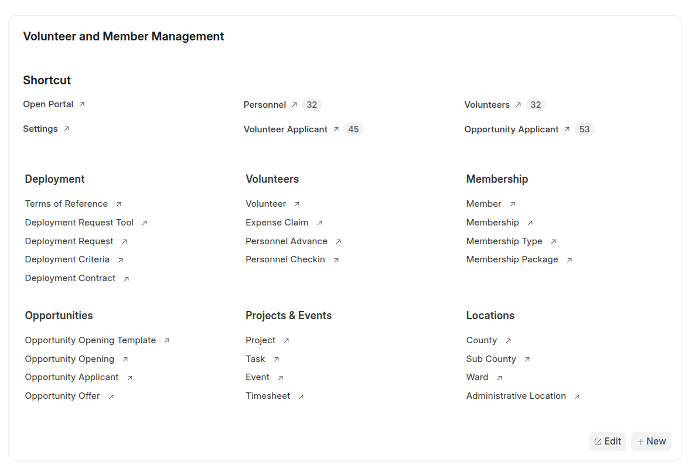

# Volunteer & Member Management (VMMS)

The **Volunteer and Member Management System (VMMS)** is a comprehensive extension for [Frappe](https://frappe.io/), designed to streamline the management of **volunteers, memberships, deployments, and events** — all within one cohesive platform.

Perfect for organizations managing humanitarian, community, or professional networks.



---

## [Volunteer Management](./onerc_vmms/docs/Volunteer-Management.md)

A complete module for onboarding, organizing, and deploying volunteers across programs and events.

### Core Features

1. **Volunteer Registration**

   - Self-service or admin-assisted volunteer registration.
   - Capture personal, skill, and interest profiles.
   - Smart categorization (by location, skill, or department).

2. **Availability & Deployment**

   - Volunteers set availability and preferred locations.
   - Deployment requests sent to matching volunteers.
   - Volunteers can accept or decline assignments in-app or via email.

3. **Deployment Operations**

   - Manage deployment details, attendance tracking, and duty rosters.
   - Record allowances, advances, and post-deployment reports.

**[See Volunteer Management Documentation →](./onerc_vmms/docs/Volunteer-Management.md)**

---

## [Membership Management](./onerc_vmms/docs/Membership-Management.md)

Empower your organization with structured membership tiers, renewals, and payments.

### Key Features

- **Membership Registration**

  - Assign members to administrative or regional branches.

- **Payment & Approval Workflow**

  - Members initiate payments online or offline.
  - Staff review and approve memberships seamlessly.
  - Integration-ready with payment gateways or manual receipts.

- **Renewal Management**

  - Automated reminders for renewals.

**[See Membership Management Documentation →](./onerc_vmms/docs/Membership-Management.md)**

---

## Event Management

Plan, publish, and manage internal, public, and private events — from registration to attendance.

### Features

- **Event Types**: Internal, Public, or Private.
- **Registrations**: Track attendees and participation.

**[See Event Management Documentation →](./onerc_vmms/docs/Events.md)**

---

## Opportunity Applications

A powerful tool for managing applications to internal and external opportunities.

### Highlights

- **Guest vs Internal Applications**

  - Public (guest) and authenticated (member) workflows.

- **Knockout Questions**

  - Auto-screen candidates based on configurable criteria.

- **Advanced Screening**

  - Multi-step application forms with dynamic validations.

**[See Opportunity Applications Documentation →](./onerc_vmms/docs/Opportunities.md)**

---

## Key Doctypes & Customizations

Explore the doctypes powering VMMS — structured to support flexibility and scalability.

### Core Doctypes & Customizations

- [User](./onerc_vmms/docs/doctypes/User.md)
- [Personnel](./onerc_vmms/docs/doctypes/Personnel.md)
- [Settings](./onerc_vmms/docs/doctypes/Settings.md)
- [Deployment Tool](./onerc_vmms/docs/Deployment-Tool.md)
- [Deployment Terms of Reference](./onerc_vmms/docs/doctypes/TOR.md)
- [Member](./onerc_vmms/docs/doctypes/Member.md)
- [Membership](./onerc_vmms/docs/doctypes/Membership.md)
- [Opportunity Opening](./onerc_vmms/docs/doctypes/Opportunity-Opening.md)
- [Opportunity Applicant](./onerc_vmms/docs/doctypes/Opportunity-Applicant.md)

---

## Installation (Self-Hosted)

```bash
# Install Bench (if not already)
https://github.com/frappe/bench

# Get the app
cd $PATH_TO_YOUR_BENCH
bench get-app https://github.com/kenyaredcross/onerc_vmms.git --branch develop

# Install on your site
bench --site [site_name] install-app onerc_vmms
```

---

## Documentation & Support

Need help? Browse detailed guides, FAQs, or open an issue in our GitHub repository.

[](https://github.com/kenyaredcross/onerc_vmms/wiki)
[](https://docs.erpnext.com)
[](https://frappeframework.com/docs)
[](https://discuss.frappe.io)
[](https://github.com/kenyaredcross/onerc_vmms.git/issues)
[](https://navari.co.ke)
