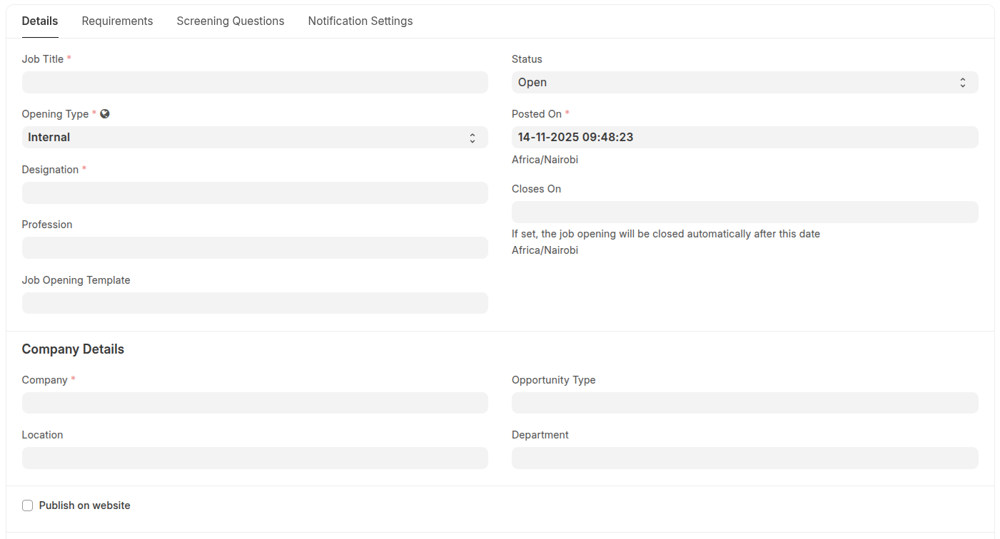
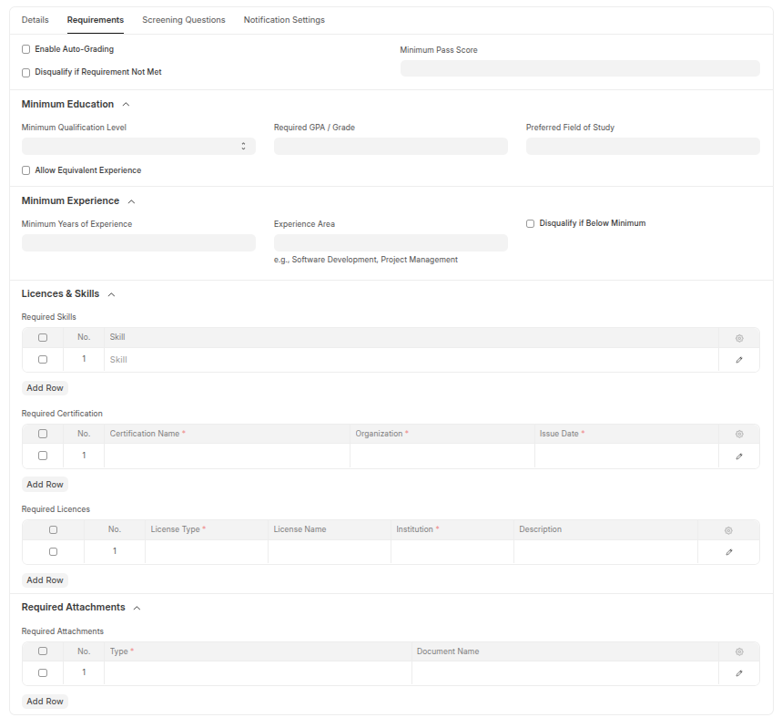
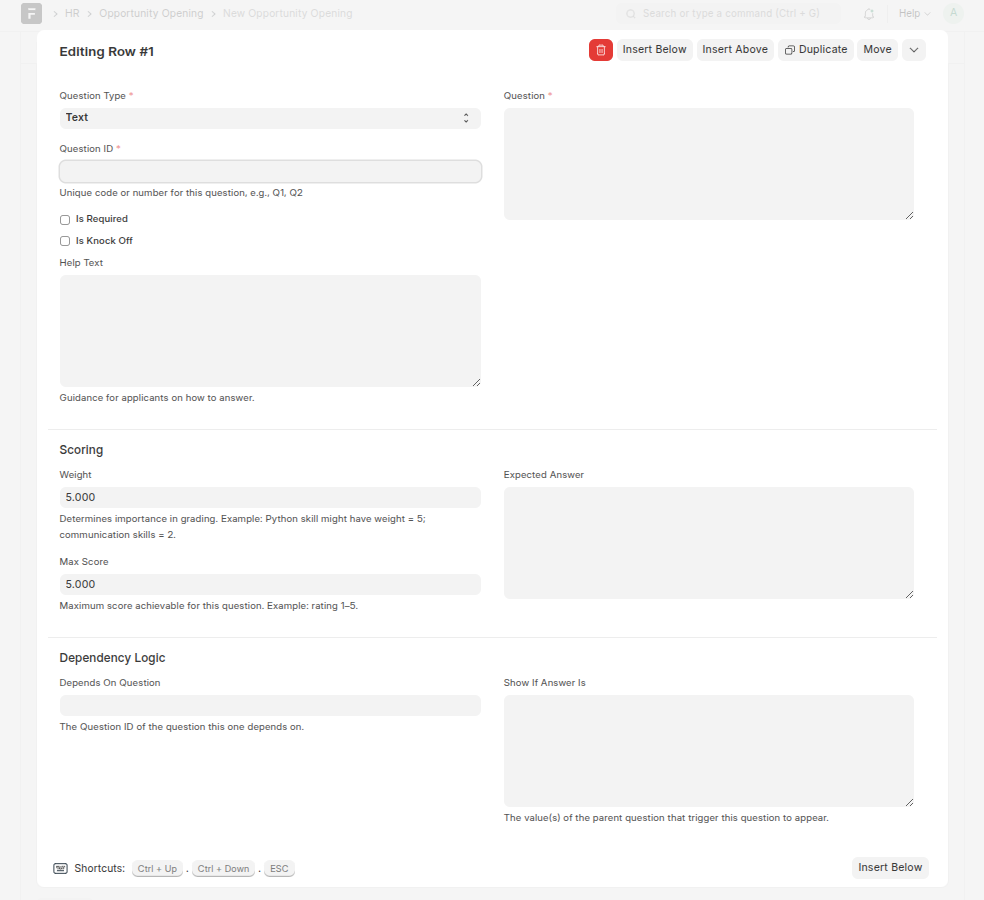
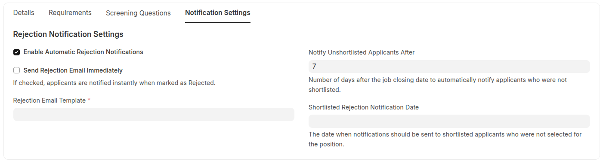

# Opportunity Opening

The Opportunity Opening is a translated version of standard Job Opening DocType — extended to support both employment and volunteer opportunities.
This transition ensures compatibility with the Volunteer and Member Management System (VMMS).

---

## Extended Fields

| Field                    | Type       | Description                                                                                                                          |
| ------------------------ | ---------- | ------------------------------------------------------------------------------------------------------------------------------------ |
| **Opening Type**         | **Select** | Classifies the opportunity as either _Internal (Employment)_ or _Guest (Volunteer/External)_. Controls access rules and eligibility. |
| **Profession**           | **Link**   | Associates the opening with a defined professional category for improved skill and qualification matching.                           |
| **Job Opening Template** | **Link**   | Enables creation of opportunities from reusable templates for consistent configuration.                                              |

## Screening & Qualification Requirements

### Education Requirements

| Field | Type | Description |
| ------------------------------------- | ------ | -------------------------------------------------------------------------- |
| **Enable Auto-Grading** | Check | Activate automated application scoring system |
| **Disqualify if Requirement Not Met** | Check | Automatically reject applications not meeting minimum criteria |
| **Minimum Pass Score** | Float | Required scoring threshold for application consideration |
| **Minimum Qualification Level** | Select | Education level: Primary, Secondary, Undergraduate, Graduate, Postgraduate |
| **Allow Equivalent Experience** | Check | Accept relevant work experience as qualification substitute |
| **Required GPA / Grade** | Data | Minimum academic performance requirement |
| **Preferred Field of Study** | Data | Desired educational background or major |

### Experience Requirements

| Field                           | Type  | Description                                                    |
| ------------------------------- | ----- | -------------------------------------------------------------- |
| **Minimum Years of Experience** | Float | Required number of years in relevant field                     |
| **Experience Area**             | Data  | Specific industry or functional experience required            |
| **Disqualify if Below Minimum** | Check | Automatically reject applications with insufficient experience |

---

## Skills & Certifications

### Licences & Skills Section

| Field                      | Type  | Description                                    |
| -------------------------- | ----- | ---------------------------------------------- |
| **Required Skills**        | Table | Mandatory skills with proficiency levels       |
| **Required Certification** | Table | Professional certifications and credentials    |
| **Required Licences**      | Table | Regulatory or professional licenses required   |
| **Required Attachments**   | Table | Mandatory document submissions for application |

---

## Screening Questions

| Field                   | Type   | Description                                    |
| ----------------------- | ------ | ---------------------------------------------- |
| **Screening Questions** | Table  | Custom qualification assessment questions      |
| **Question Type**       | Select | Type of question (Multiple Choice, Text, etc.) |
| **Weight**              | Float  | Scoring weight for automated evaluation        |
| **Required**            | Check  | Whether question must be answered              |

---

## Notification Settings

### Rejection Notification Settings

| Field                                        | Type  | Description                                                  |
| -------------------------------------------- | ----- | ------------------------------------------------------------ |
| **Enable Automatic Rejection Notifications** | Check | System-generated rejection email notifications               |
| **Send Rejection Email Immediately**         | Check | Instant notification when application is rejected            |
| **Rejection Email Template**                 | Link  | Custom email template for rejection communications           |
| **Notify Unshortlisted Applicants After**    | Int   | Days after closing date to notify non-shortlisted applicants |
| **Shortlisted Rejection Notification Date**  | Date  | Specific date to notify rejected shortlisted candidates      |

---

## Navigation

  

  

  

## Documentation & Support

Need help? Browse detailed guides, FAQs, or open an issue in our GitHub repository.

