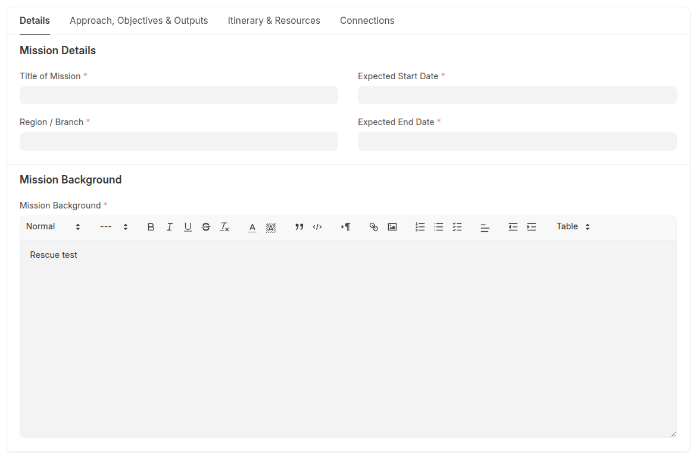
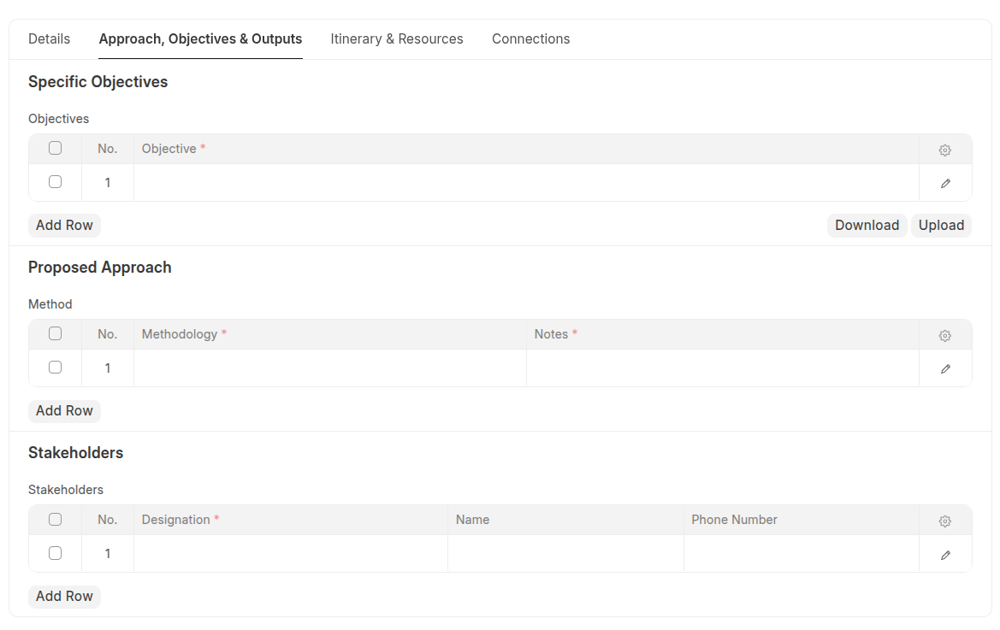

# Personnel Terms of Reference (TOR)

The **Personnel Terms of Reference (TOR)** serves as a foundational planning and authorization document for projects and assignments.
It captures critical information such as mission background, stakeholders, objectives, methodologies, itinerary, and budget/resource requirements.

Once approved, the TOR can be linked directly to:

- **Deployment Request Tools** (for field missions)
- **Projects** (for structured assignments or funded activities)

This ensures seamless traceability between mission planning, execution, and post-activity reporting.

---

## Key Fields

| Field                         | Type                           | Description                                                          |
| ----------------------------- | ------------------------------ | -------------------------------------------------------------------- |
| **Title of Mission**          | Data                           | Mission name or identifier.                                          |
| **Region / Branch**           | Link (Company)                 | The branch or regional office responsible.                           |
| **Expected Start / End Date** | Date                           | Duration of the mission.                                             |
| **Mission Background**        | Text Editor                    | Context and rationale for the mission.                               |
| **Stakeholders**              | Table (`TOR Stakeholders`)     | Lists all individuals or organizations involved.                     |
| **Objectives**                | Table (`TOR Objectives`)       | Defines specific mission objectives.                                 |
| **Expected Outputs**          | Table (`TOR Outputs`)          | Anticipated deliverables or results.                                 |
| **Approach Methodology**      | Table (`TOR Approach Methods`) | Strategy, methodologies, or frameworks used.                         |
| **Itinerary**                 | Table (`TOR Itinerary`)        | Detailed schedule of activities, persons responsible, and timelines. |
| **Resources**                 | Table (`TOR Resources`)        | Resource plan, donors, quantities, and estimated costs.              |

---

## Supporting Child Tables

Each child DocType captures a specific structural component of the TOR.

### `TOR Stakeholders`

Defines key mission participants and contacts.

| Field        | Description                       |
| ------------ | --------------------------------- |
| Designation  | Role or title of the stakeholder. |
| Name         | Full name.                        |
| Phone Number | Contact information.              |

---

### `TOR Objectives`

Lists the **specific objectives** that the mission aims to achieve.

| Field     | Description                                        |
| --------- | -------------------------------------------------- |
| Objective | Short description of the goal or intended outcome. |

---

### `TOR Outputs`

Captures the **expected deliverables** or measurable results.

| Field  | Description                                   |
| ------ | --------------------------------------------- |
| Output | Expected product, report, or tangible result. |

---

### `TOR Approach Methods`

Documents the methodologies and notes to guide mission execution.

| Field       | Description                                             |
| ----------- | ------------------------------------------------------- |
| Methodology | Reference to a defined methodology (`TOR Methodology`). |
| Notes       | Additional details or specific adaptations.             |

---

### `TOR Methodology`

A reusable list of available methodologies (e.g., Assessment, Capacity Building, Evaluation).
Can be maintained and expanded by system managers.

---

### `TOR Itinerary`

Details the **mission plan and schedule**.

| Field              | Description                         |
| ------------------ | ----------------------------------- |
| Date               | Scheduled date.                     |
| Time               | Planned time.                       |
| Person Responsible | Assigned person for the activity.   |
| Activity           | Description of the task or session. |

---

### `TOR Resources`

Defines the **resources, donors, and associated costs** for the mission.

| Field           | Description                                            |
| --------------- | ------------------------------------------------------ |
| Date            | Date of resource utilization or allocation.            |
| Resource        | Description of resource or item.                       |
| Donor           | Linked donor record (`VM Donor`).                      |
| Project Code    | Related project identifier.                            |
| Quantity / Unit | Quantity and measurement unit.                         |
| Cost Per Day    | Cost rate per day.                                     |
| Total Cost      | Automatically calculated from quantity × cost per day. |

---

### `TOR Person Responsible`

A simplified table for referencing responsible individuals during TOR execution.

---

### `TOR Accompanying Staff`

Lists employees or accompanying personnel for the mission.

| Field       | Description           |
| ----------- | --------------------- |
| Name        | Linked User/Employee. |
| Designation | Role in the mission.  |

---

## Documentation & Support

Need help? Browse detailed guides, FAQs, or open an issue in our GitHub repository.

