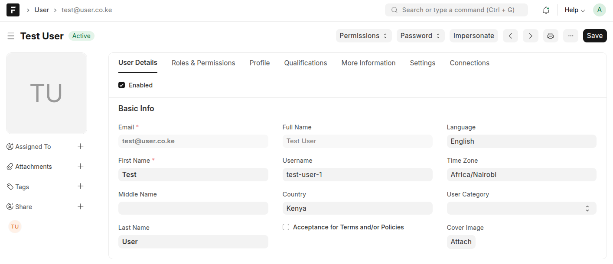
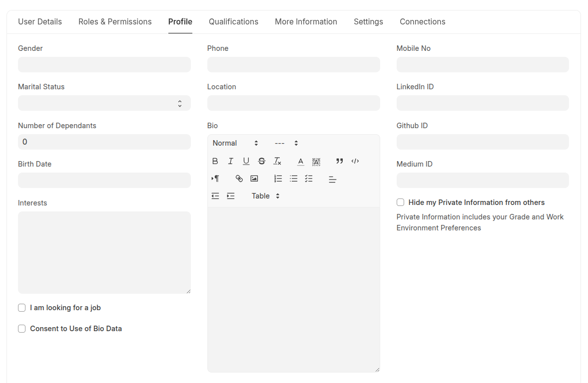
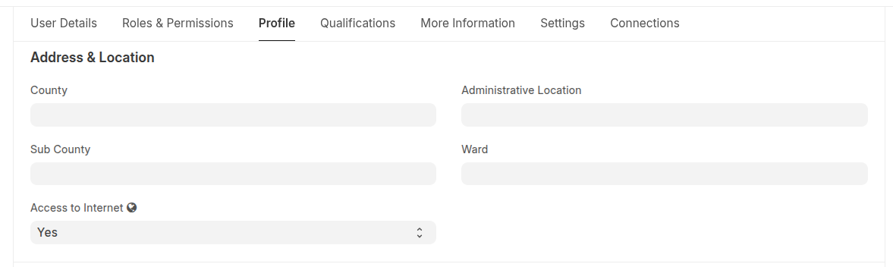
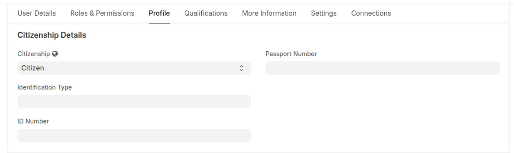
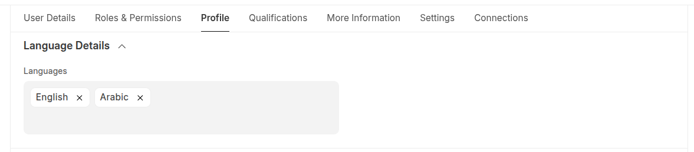
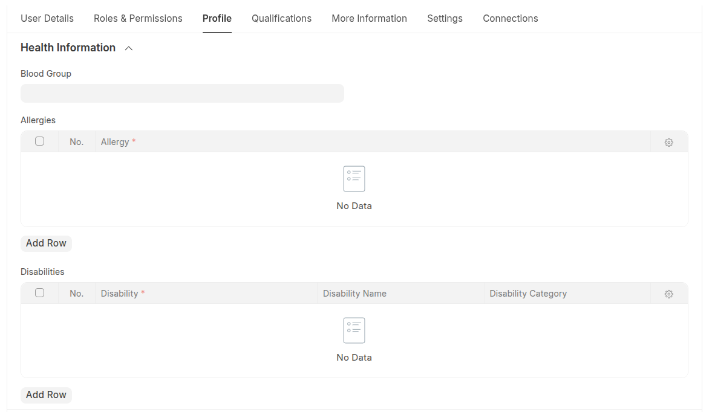
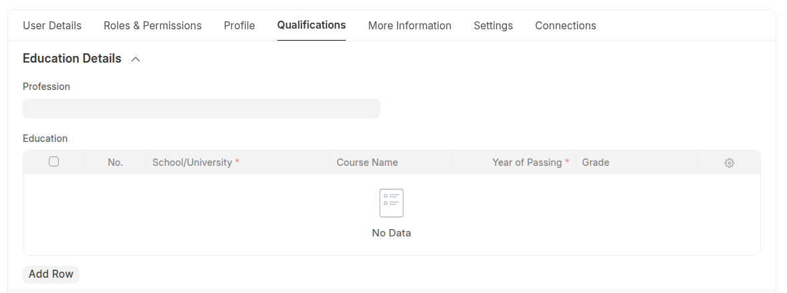
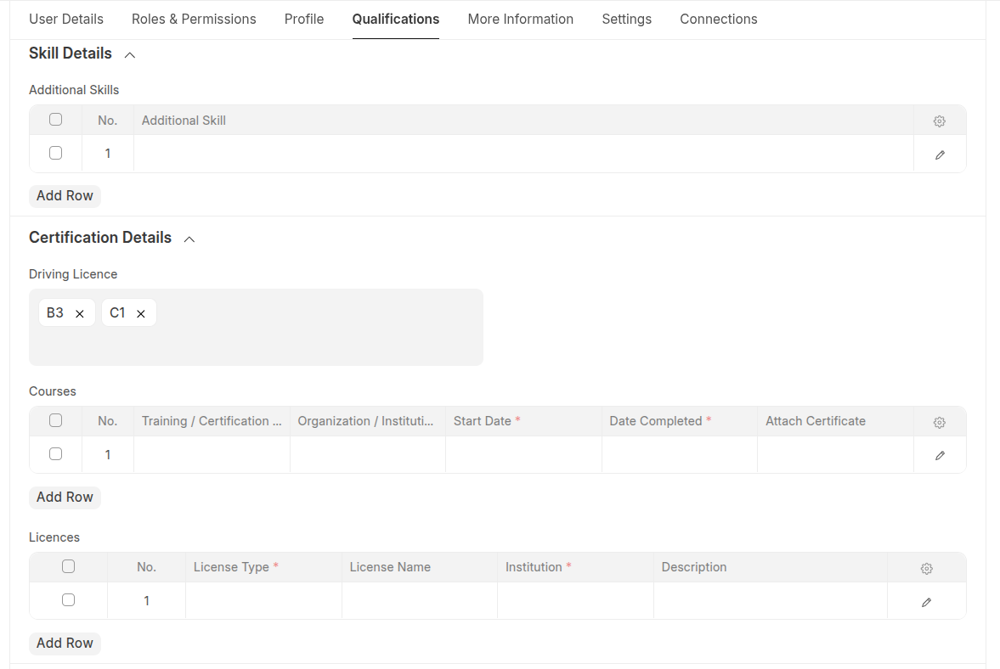
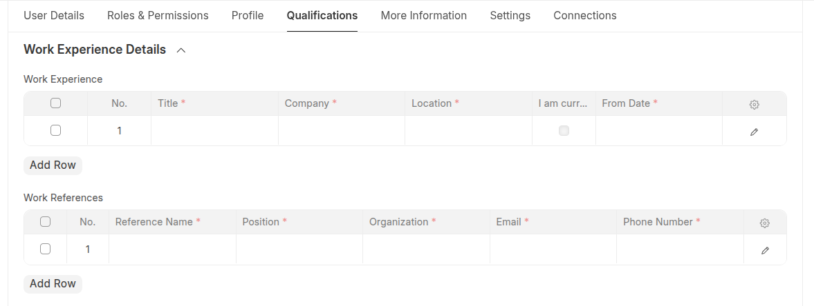
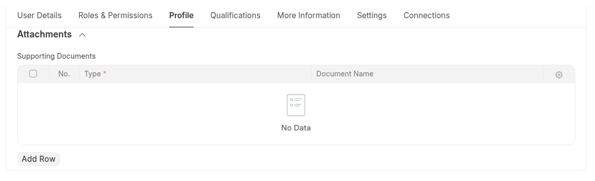

# User

The **User** doctype has been extended to support comprehensive volunteer and personnel management capabilities. These enhancements provide detailed profile information, qualifications tracking, and location data essential for managing both staff and volunteers within the Volunteer and Member Management System (VMMS).

## Key Features

The **User** doctype has been extended to capture richer personal, professional, and health information. This includes detailed bio data, qualifications, skills, work experience, and location details.

These enhancements allow users to maintain up-to-date profiles that reflect their current competencies, certifications, and availability. The system can automatically fetch this information to **build resumes or profiles** for applications, volunteer engagement, and internal opportunity tracking, ensuring consistency and reducing repetitive data entry.

Additionally, the extended profile supports dynamic updates, enabling users to continually refine their personal and professional information over time.

## Extended Profile Information

### Personal Details

| Field                          | Type   | Description                               |
| ------------------------------ | ------ | ----------------------------------------- |
| **Marital Status**             | Select | Single, Married, Divorced, Widowed, Other |
| **Number of Dependants**       | Int    | Number of dependant family members        |
| **Consent to Use of Bio Data** | Check  | Permission for biometric data processing  |

## Address & Location Details

| Field                       | Type   | Description                               |
| --------------------------- | ------ | ----------------------------------------- |
| **LGA**                     | Link   | Administrative LGA                        |
| **District**                | Link   | District administrative division          |
| **Access to Internet**      | Select | Internet availability: Yes, No, Sometimes |
| **Administrative Location** | Link   | Specific administrative location          |
| **Ward**                    | Link   | Local ward information                    |

## Citizenship & Identification

| Field                      | Type   | Description                                   |
| -------------------------- | ------ | --------------------------------------------- |
| **Citizenship**            | Select | Citizen, Non-citizen, Refugee, Migrant, Other |
| **Identification Type**    | Link   | Type of identification document               |
| **ID Number**              | Data   | National identification number                |
| **Country of Citizenship** | Link   | Country of citizenship                        |

---

## Language & Health Information

### Language Details

| Field         | Type              | Description              |
| ------------- | ----------------- | ------------------------ |
| **Languages** | Table MultiSelect | Languages spoken by user |

### Health Information

| Field            | Type  | Description                               |
| ---------------- | ----- | ----------------------------------------- |
| **Blood Group**  | Data  | Blood type information                    |
| **Allergies**    | Table | Medical allergies and reactions           |
| **Disabilities** | Table | Disability information and accommodations |

---

## Qualifications & Skills

### Education Details

| Field          | Type  | Description                         |
| -------------- | ----- | ----------------------------------- |
| **Profession** | Link  | Professional field or occupation    |
| **Education**  | Table | Academic qualifications and degrees |

### Skills & Certifications

| Field                 | Type              | Description                                 |
| --------------------- | ----------------- | ------------------------------------------- |
| **Skill**             | Table             | User skills and competencies                |
| **Additional Skills** | Table             | Supplementary skills and qualifications     |
| **Driving Licence**   | Table MultiSelect | Valid driving licence categories            |
| **Certification**     | Table             | Professional certifications and credentials |
| **Courses**           | Table             | Professional courses and training           |

---

## Work Experience & References

| Field               | Type  | Description                          |
| ------------------- | ----- | ------------------------------------ |
| **Work Experience** | Table | Employment history and positions     |
| **Work References** | Table | Professional references and contacts |

---

## Supporting Documents

| Field                    | Type  | Description                   |
| ------------------------ | ----- | ----------------------------- |
| **Supporting Documents** | Table | Additional required documents |

## Navigation

  

  

## Documentation & Support

Need help? Browse detailed guides, FAQs, or open an issue in our GitHub repository.

